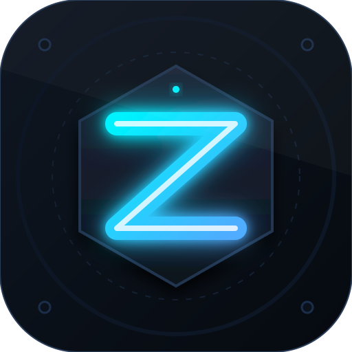

<div align="center">



# ZhoraWallet

### 🔐 Air-gapped холодный кошелёк Ethereum

[](https://tauri.app)
[](https://vuejs.org)
[](https://www.rust-lang.org)
[](LICENSE)
[](SECURITY_AUDIT.md)

> Десктопное приложение для безопасного хранения ETH с подписью транзакций на офлайн-машине через USB.  
> Приватный ключ **никогда** не покидает изолированную среду.

</div>

---

## 🏗️ Как это работает

```
┌─────────────────────┐     USB     ┌──────────────────────┐
│     ОНЛАЙН-ПК        │◄──────────►│     ОФЛАЙН-ПК          │
│                      │  pending/  │                       │
│  ZhoraWallet         │  signed/   │  ZhoraWallet          │
│  ─────────────────   │            │  ──────────────────   │
│  • Баланс / История  │            │  • Приватный ключ     │
│  • Создание TX       │            │  • Подпись TX         │
│  • Broadcast в сеть  │            │  • Мнемоника 24 слова │
└─────────────────────┘            └──────────────────────┘
```

---

## ⚡ Быстрый старт

### Требования

- **Rust** — https://www.rust-lang.org/tools/install
- **Node.js 18+** — https://nodejs.org/

### Установка и запуск

```bash
# Клонировать репозиторий
git clone https://github.com/Zhoraaaaaa842/coldwallet.git
cd coldwallet/zhorawallet-tauri

# Установить зависимости
npm install

# Режим разработки
npm run tauri dev

# Сборка для продакшена
npm run tauri build
```

> Собранные файлы: `zhorawallet-tauri/src-tauri/target/release/bundle/`

---

## 📦 Стек технологий

### 🖥️ Frontend

| Компонент | Технология |
|---|---|
| UI Framework | Vue 3 + TypeScript |
| Стили | TailwindCSS |
| Сборка | Vite |
| State Management | Pinia |
| Роутинг | Vue Router |

### ⚙️ Backend (Tauri / Rust)

| Компонент | Крейт |
|---|---|
| Десктоп-оболочка | `tauri 2.0` |
| BIP-39 мнемоника | `bip39` |
| ECDSA secp256k1 + адреса | `k256` |
| AES-256-GCM шифрование | `aes-gcm` |
| PBKDF2-SHA256 деривация | `pbkdf2` |
| Keccak-256 | `tiny-keccak` |
| Ethereum RPC | `reqwest` |
| QR-коды | `qrcode-generator` |

---

## 🔄 Отправка ETH — пошагово

```
[Онлайн] Создать TX  →→→  USB  →→→  [Офлайн] Подписать  →→→  USB  →→→  [Онлайн] Broadcast
```

1. **ZhoraWallet (онлайн)** → вкладка «Отправить» → адрес, сумма, gas → **«Создать TX → USB»**
2. Переставь USB в **офлайн-ПК** (без интернета)
3. **ZhoraWallet (офлайн)** → сканировать `pending/` → ввести пароль → подписать
4. Переставь USB обратно в **онлайн-ПК**
5. **ZhoraWallet (онлайн)** → сканировать `signed/` → **«Отправить в сеть»**

---

## 🛡️ Безопасность

| Компонент | Реализация |
|---|---|
| Шифрование vault | AES-256-GCM |
| Деривация пароля | PBKDF2-SHA256, **600 000 итераций** |
| Хранение ключей | BIP-39 мнемоника (24 слова) |
| HD деривация | BIP-44 `m/44'/60'/0'/0/0` |
| Транзакции | EIP-1559 + Legacy, ECDSA secp256k1 |
| Защита USB path | Canonicalize + prefix-check |
| Запись vault | `.tmp` + `rename()` (атомарная) |

### ⚠️ Золотые правила

- Офлайн-ПК запускать **строго без интернета**
- Мнемонику (24 слова) хранить **на бумаге**, отдельно от USB
- USB — только для переноса `pending/` и `signed/`, ничего лишнего

📋 Полный аудит безопасности: [SECURITY_AUDIT.md](SECURITY_AUDIT.md)

---

## 🗂️ Структура проекта

```
coldwallet/
├── zhorawallet-tauri/            ← Tauri приложение (Vue 3 + Rust)
│   ├── src/                      ← Frontend (Vue + TypeScript)
│   │   ├── components/           ← Vue компоненты
│   │   ├── views/                ← Страницы (Dashboard, Send, Receive...)
│   │   ├── stores/               ← Pinia stores
│   │   └── composables/          ← Vue composables
│   └── src-tauri/                ← Backend (Rust)
│       └── src/
│           ├── commands.rs       ← 17 Tauri команд
│           ├── crypto.rs         ← BIP-39, AES-GCM, подпись
│           ├── network.rs        ← Ethereum RPC
│           ├── usb.rs            ← USB детекция и файловые операции
│           └── state.rs          ← AppState
├── ico.svg
├── CHANGES.md
└── SECURITY_AUDIT.md
```

---

## 🌐 Поддерживаемые сети

| Сеть | Chain ID |
|---|---|
| Ethereum Mainnet | `1` |
| Sepolia Testnet | `11155111` |
| Custom RPC | настраивается в UI |

---

## 💾 Структура USB-носителя

```
USB/
└── ColdVault/
    ├── wallet.vault       ← зашифрованный кошелёк (AES-256-GCM)
    ├── config.json        ← chain_id, сеть
    ├── pending/           ← неподписанные транзакции
    └── signed/            ← подписанные транзакции
```

---

<div align="center">

> ⚠️ ZhoraWallet — **программный** холодный кошелёк.  
> Не является заменой аппаратных решений (Ledger, Trezor).  
> Рекомендуется для обучения и хранения умеренных сумм.

**Made with 🦀 Rust + 💚 Vue**

</div>
